# Daiba Nana theme

A dark Neovim colorscheme inspired by **Daiba Nana** from *Revue Starlight*.

Deep curtain-like backgrounds, wine red accents, antique gold 
highlights, and soft cream text — designed to feel theatrical, warm, and readable.

## Preview

### lua

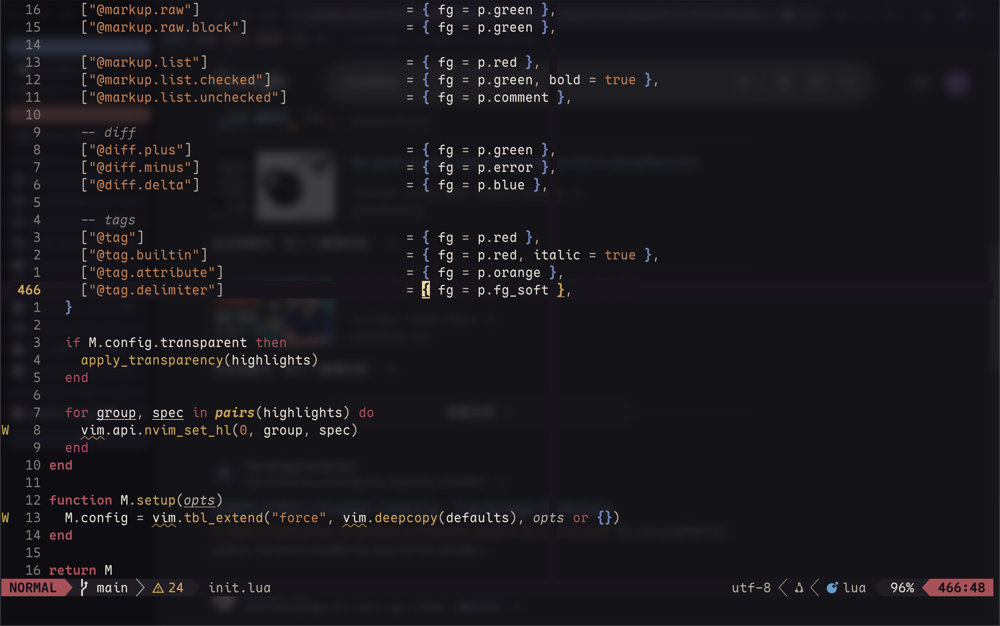
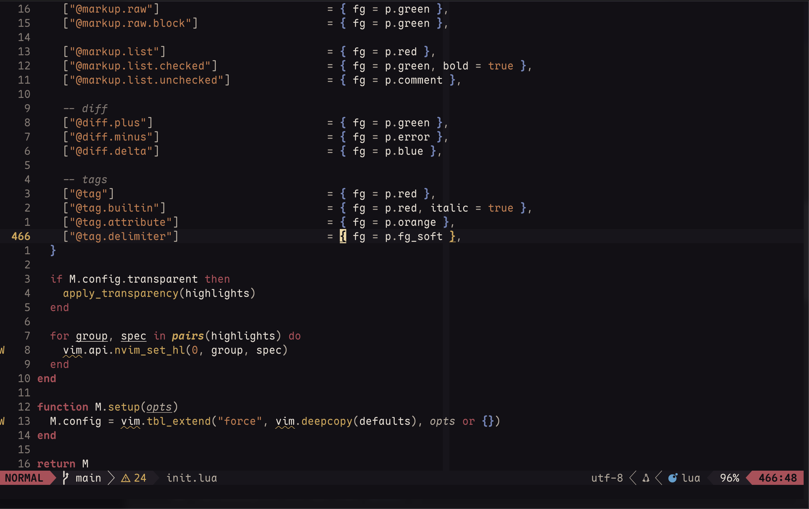

### go

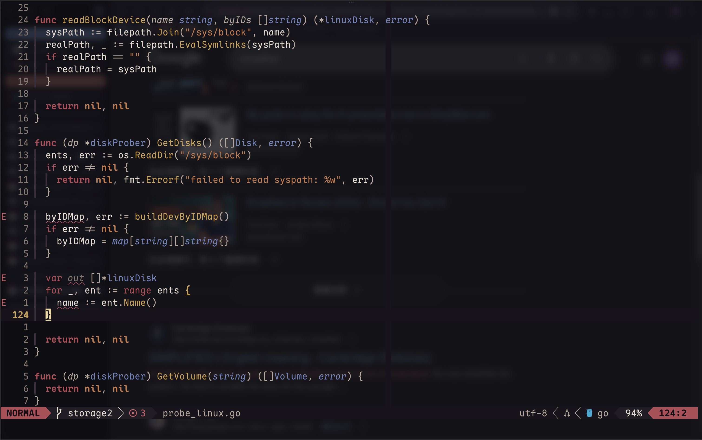
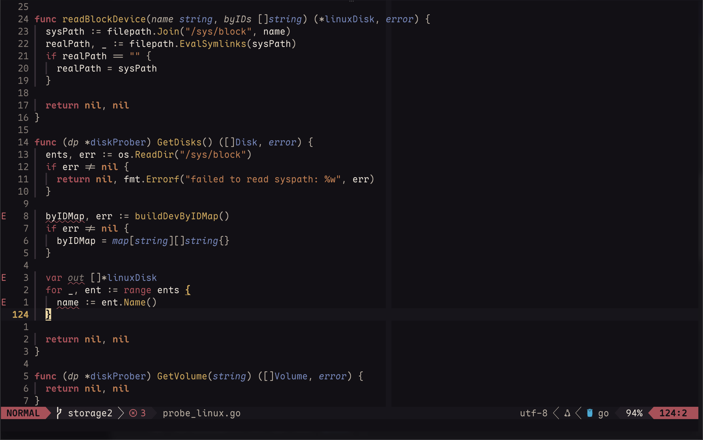

### rust

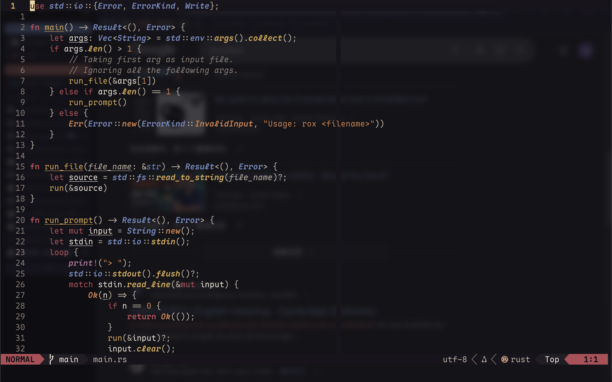
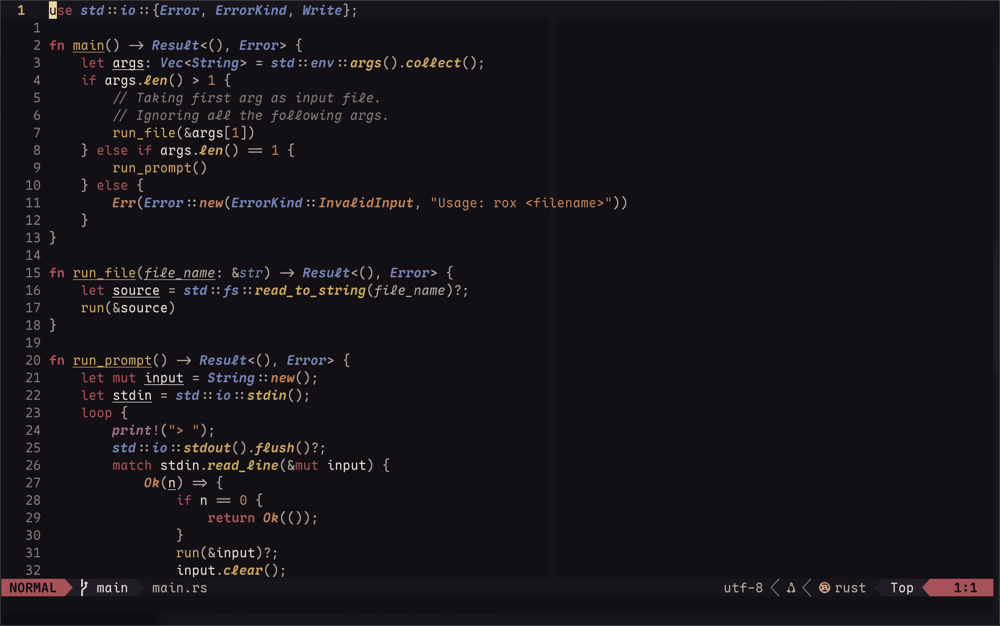

### completion menu([blink.cmp](https://cmp.saghen.dev/))

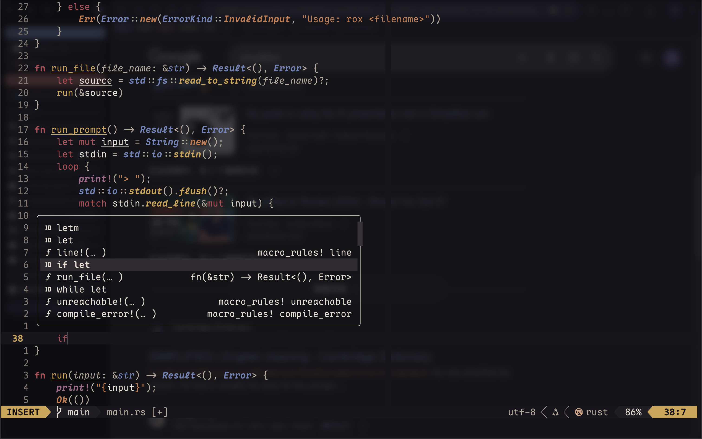
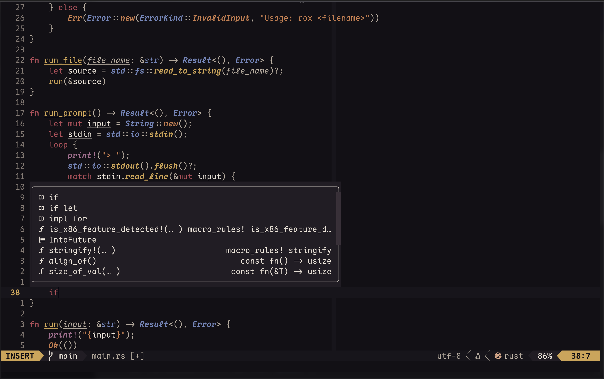

### terminal
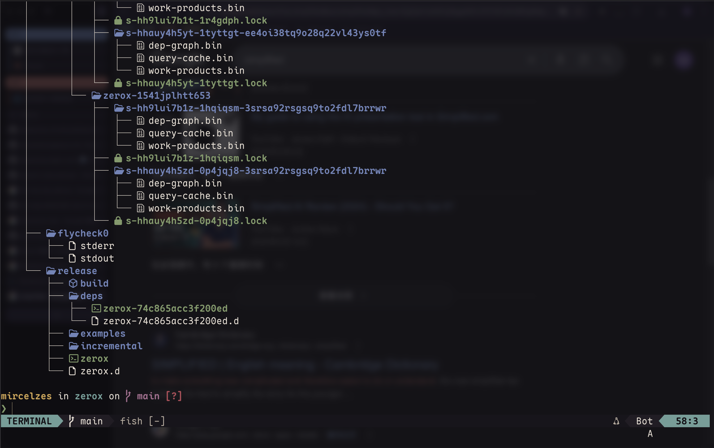
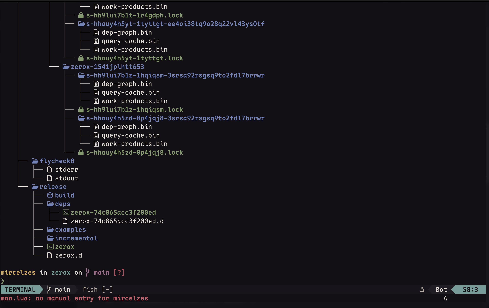

## Install

### vim.pack

```lua
vim.pack.add({ 
  src = "https://github.com/miRceLzeS/daibanana.nvim",
  name = "daibanana",
})
require("daibanana").setup()
vim.cmd("colorscheme daibanana")
```

## Configuration

> Since the color scheme is very minimal, feel free to change
> the preset as you want.
> For convenience, there is single option for toggling background
> transparency.

```lua
require("daibanana").setup({ transparent = true })
vim.cmd("colorscheme daibanana")
```

It just works.

## Integration

- general highlight groups built-in neovim
- treesitter
- lsp semantic token

### plugin support

#### [Lualine](https://github.com/nvim-lualine/lualine.nvim)

> Make sure you have already [install and set up daibanana](#Install).

```lua
require("lualine").setup({ options = { theme = "daibanana" }})
```

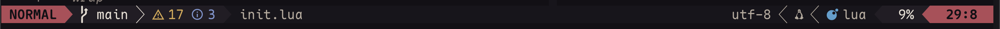


## Thank you

Basically this plugin is designed according to my need. Feel free
to make a pull request or make issues.
